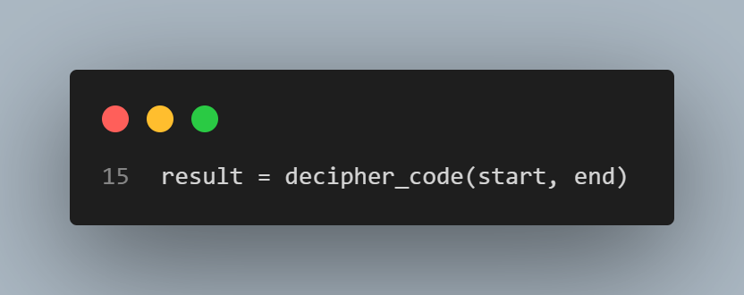

# Polkadot Secret Code
## Full code

## Code Breakdown

   - The `decipher_code(start, end)` function processes a range of numbers defined by `start` and `end`.

   - We initialize a `value` to 0 to track the result as we iterate through the range.

   - For each number in the range, the function follows these rules:

      
       - If a number is a multiple of both 3 and 5, it is skipped.

      
       - If a number is a multiple of 3, it is added to `value`.
       
      
       - If a number is a multiple of 5, it is subtracted from `value`.

   - After processing all numbers, the function returns the final `value`, representing the result of the additions, subtractions, and skips.

   - The user is then prompted to input the start and end of the range.

   - The `decipher_code` function is executed with the provided input.

   - Finally, the calculated `value` is printed, displaying the result to the user.