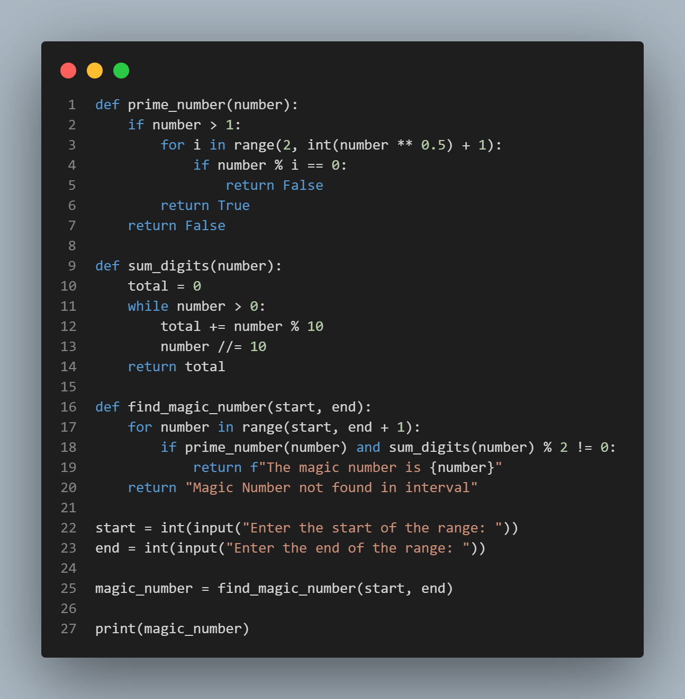
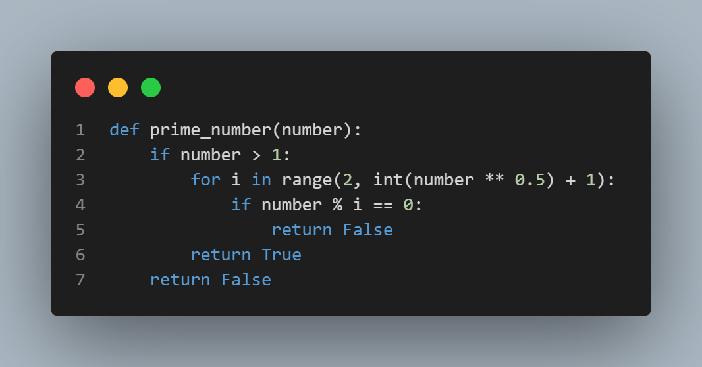
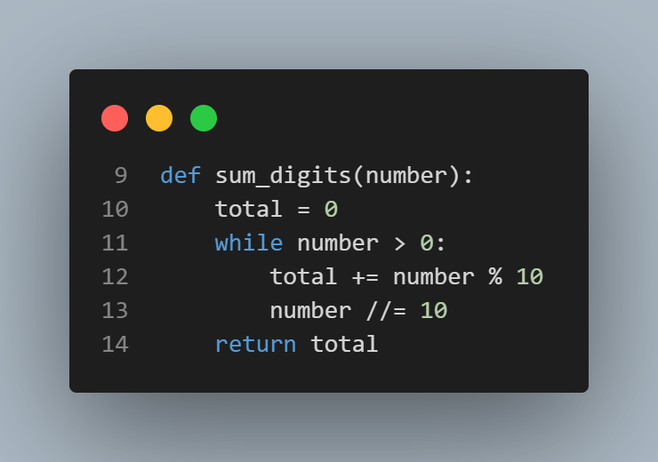
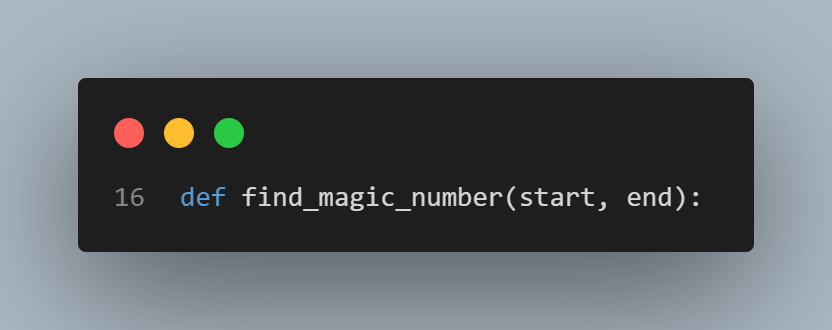
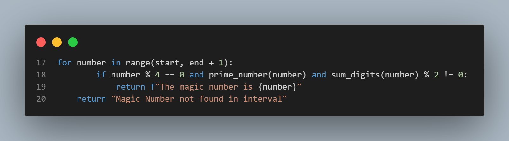
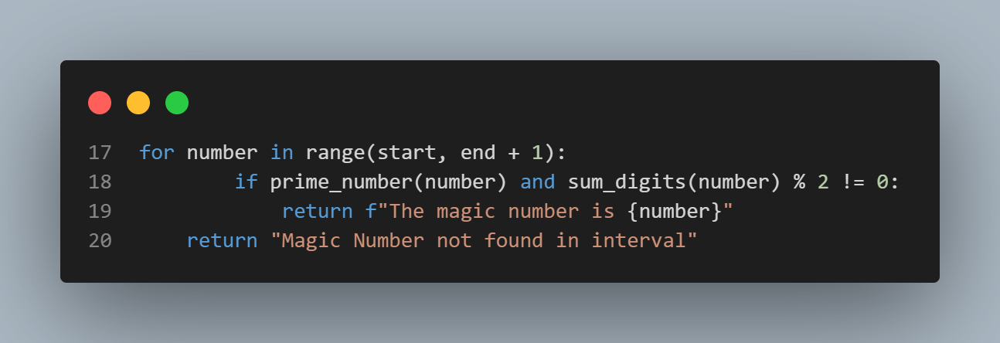
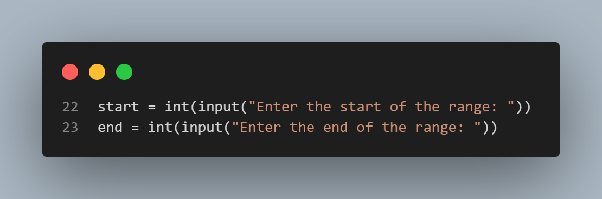
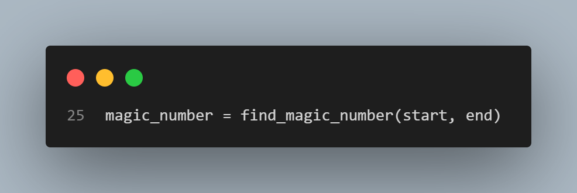
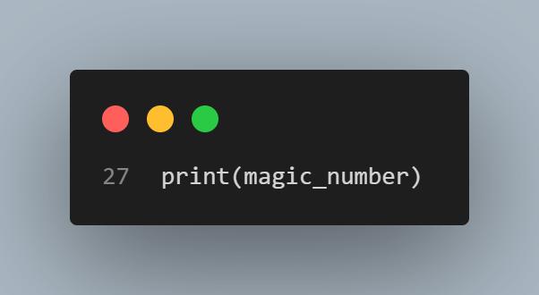

# Polkadot Magic Number
## Full code

## Code Breakdown

   - The `prime_number(number)` function checks if a number is prime by testing divisibility up to its square root, ensuring efficiency.

   - The `sum_digits(number)` function calculates the sum of a number's digits until it reaches zero.

   - The `find_magic_number(start, end)` function searches within a specified range, start to end, for a "magic number."

   - For each number in the range, the function checks if it meets all conditions: If the number is prime and the sum of its digits is odd, the function identifies it as the "magic number." If no number meets these criteria, it returns "Magic Number not found in interval." *Originally, the code included a condition for divisibility by 4, but since a prime number cannot be divisible by 4 (except by itself), I removed this condition after discussing with my teacher, the code is now:*
   

   - The user is prompted to input the start and end of the range.

   - The `magic_number` function is then executed with the user's input.

   - Finally, the result is printed, indicating either the magic number found or that no magic number exists in the given range.