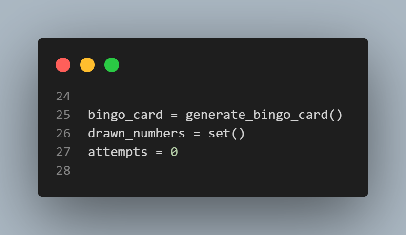
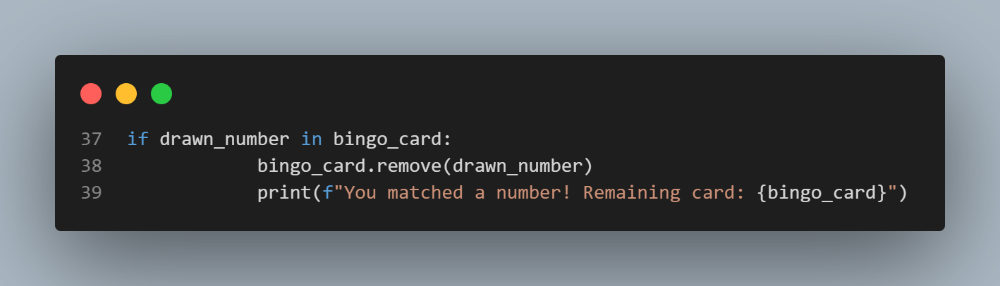

# Guessing bingo explained
## Full code

## Code Breakdown

   - The `generate_bingo_card` function generates a Bingo card by creating a list of 5 unique random numbers between 1 and 75. These numbers represent the numbers on the player's card.

   - The `draw_number` function selects a random number between 1 and 75 that hasn't been drawn before. It keeps track of all previously drawn numbers to ensure no duplicates are selected.

   - The `guess_number(drawn_number)` function asks the user to guess the number drawn by the computer. If the guessed number is incorrect, the function provides feedback to guess higher or lower until the correct number is guessed. Once the user guesses the correct number, the function returns the guessed number.

   - The `play_bingo()` function is where the main game logic is implemented:
       
      It first prints a welcome message: "Welcome to Polkadot guessing bingo!"
       
      It generates the Bingo card using the `generate_bingo_card` function and initializes a set to keep track of drawn numbers and an attempt counter.
       
      The game then enters a loop that continues until all numbers on the Bingo card are guessed correctly.

   - Within the loop:
       
      The computer draws a number using `draw_number`.
       
      The user is prompted to guess this number via the `guess_number` function.
       
      If the guessed number is on the Bingo card, it is removed, and a message is displayed: "You matched a number! Remaining card: [remaining numbers]."
       
      If the guessed number is not on the Bingo card, a message is displayed: "You guessed the number right, but it's not on your card."

   - The game continues drawing and guessing numbers until the Bingo card is empty, at which point the game ends. The total number of attempts (draws) required to complete the card is then displayed, concluding the game with a message: "Bingo! You completed the card in [attempts] draws."